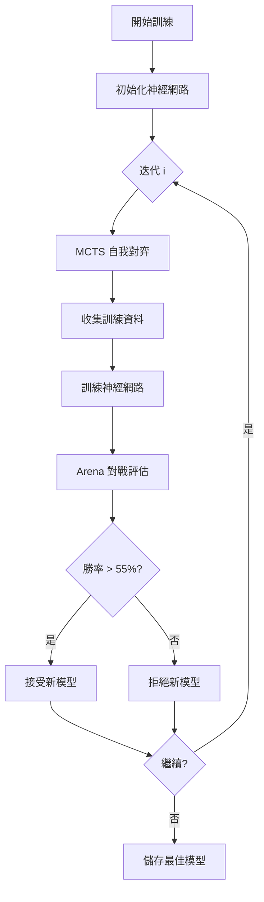
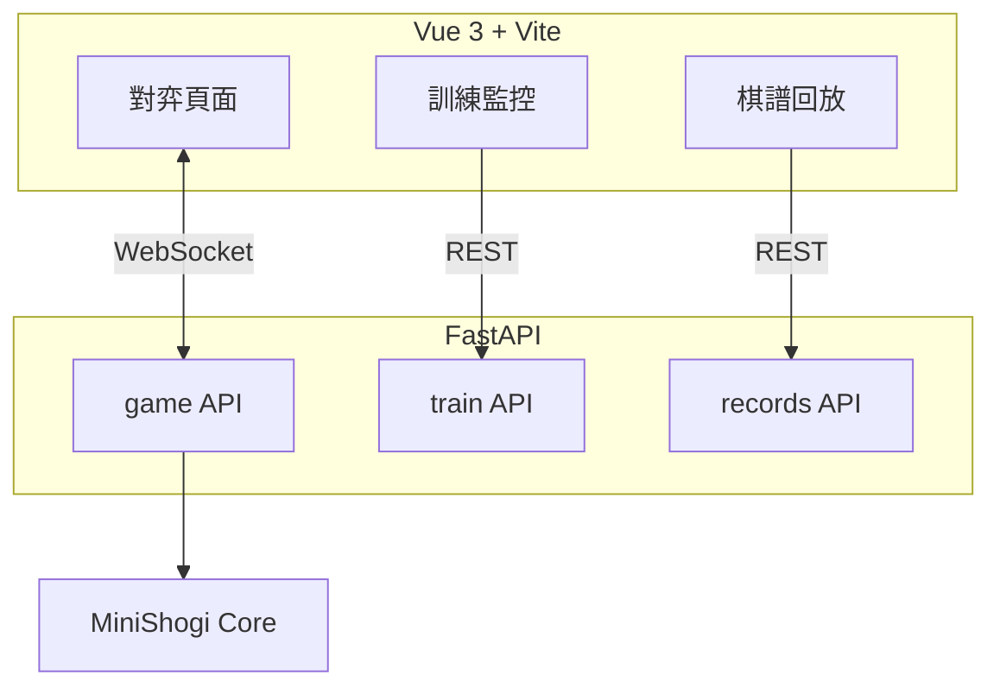

# MiniShogi - AlphaZero 實作

這是一個完整的 MiniShogi（5×5 將棋）AlphaZero 實作，基於 [alpha-zero-general](https://github.com/suragnair/alpha-zero-general) 框架開發。

---

## 快速開始

```bash
# 安裝依賴
uv sync

# 執行測試
uv run pytest tests/test_minishogi*.py -v

# 人機對弈
uv run python pit_minishogi.py

# 開始訓練
uv run python main_minishogi.py --parallel
```

---

## 遊戲規則

### 初始盤面

```
  0 1 2 3 4
  ---------
0|r b s g k   ← 後手（白方）
1|. . . . p   ← 後手的步兵
2|. . . . .
3|P . . . .   ← 先手的步兵
4|K G S B R   ← 先手（黑方）
```

### 棋子

| 棋子 | 代號 | 可升變 | 升變後 | 移動方式 |
|------|------|--------|--------|----------|
| 王將 | K | ✗ | - | 八方一格 |
| 金將 | G | ✗ | - | 前後左右 + 斜前 |
| 銀將 | S | ✓ | 成銀 | 前 + 四斜 |
| 角行 | B | ✓ | 龍馬 | 斜向滑行 |
| 飛車 | R | ✓ | 龍王 | 直線滑行 |
| 步兵 | P | ✓ | 金 | 前進一格 |

### 主要規則

- **升變區**：只有最後一行（先手第 0 行、後手第 4 行）
- **打入**：被吃掉的棋子可放回棋盤任意空格
- **二步禁止**：同一列不能有兩個未升變的步兵
- **打步詰禁止**：不能用打入步兵的方式將死對方
- **千日手**：同一局面重複 4 次，先手判負
- **千日王手**：千日手時若一方持續王手，攻擊方判負
- **最大步數**：超過 200 步自動判和局（訓練用）

---

## 專案結構

```
minishogi/
├── models.py       # 資料模型（Move、PieceType、GameConfig）
├── logic.py        # 棋盤邏輯與規則判定
├── game.py         # MiniShogiGame（框架介面）
├── players.py      # 玩家類別（Random、Human、Greedy）
├── parallel.py     # 多進程自我對弈
└── pytorch/
    ├── model.py    # CNN 神經網路架構
    └── nnet.py     # 訓練封裝器
```

---

## 訓練

### 標準訓練

```bash
uv run python main_minishogi.py --iters 100 --episodes 100
```

### 平行訓練（推薦）

```bash
uv run python main_minishogi.py --parallel --iters 100
```

使用 8 個 CPU 核心進行自我對弈，GPU 進行神經網路訓練。

### 繼續訓練

```bash
uv run python main_minishogi.py --load
```

### 訓練流程



---

## 對弈

### 人機對弈指令

```bash
# vs 隨機玩家
uv run python pit_minishogi.py

# vs 貪婪玩家
uv run python pit_minishogi.py --mode greedy

# vs 訓練好的 AI
uv run python pit_minishogi.py --mode ai --model ./minishogi_checkpoints/best.pth.tar

# AI vs AI (同一模型互相對戰)
uv run python pit_minishogi.py --mode ai_vs_ai --model ./minishogi_checkpoints/best.pth.tar

# AI vs AI (不同模型驗證，例如 best vs 訓練中的 checkpoint)
uv run python pit_minishogi.py --mode ai_vs_ai --model ./minishogi_checkpoints/best.pth.tar --model2 ./minishogi_checkpoints/checkpoint_50.pth.tar

# 貪婪演算法 vs 訓練好的 AI
uv run python pit_minishogi.py --mode greedy_vs_ai --model ./minishogi_checkpoints/best.pth.tar

# 隨機演算法 vs 訓練好的 AI
uv run python pit_minishogi.py --mode random_vs_ai --model ./minishogi_checkpoints/best.pth.tar
```

### 輸入格式

| 動作 | 格式 | 範例 |
|------|------|------|
| 移動 | `起點行 起點列 終點行 終點列 [p]` | `3 0 2 0` |
| 升變 | 在移動後加 `p` | `1 0 0 0 p` |
| 打入 | `d 棋子代碼 目標行 目標列` | `d 1 2 2` |

棋子代碼：P=1、S=2、G=3、B=4、R=5

---

## Web 前端

### 啟動開發伺服器

```bash
# 後端（Port 8000）
uv run uvicorn web.backend.main:app --reload --port 8000

# 前端（Port 5173）
cd web/frontend && npm run dev
```

瀏覽器開啟 **<http://localhost:5173>**

### 功能頁面

| 頁面 | 網址 | 說明 |
|------|------|------|
| 對弈 | `/` | 人類 vs AI 即時對弈 |
| 訓練監控 | `/dashboard` | Loss 曲線、勝率、模型列表 |
| 棋譜回放 | `/replay` | 查看與分享對局記錄 |

### 架構



---

## API 參考

### MiniShogiGame

```python
from minishogi import MiniShogiGame

game = MiniShogiGame()
board = game.getInitBoard()            # 初始盤面
size = game.getActionSize()            # 1376
valids = game.getValidMoves(board, 1)  # 合法動作遮罩
new_board, player = game.getNextState(board, 1, action)
result = game.getGameEnded(board, 1)   # 0=進行中, 1=勝, -1=敗
```

### Board

```python
from minishogi import Board

board = Board()
moves = board.get_legal_moves()    # 合法走法列表
board.execute_move(move)           # 執行走法
is_check = board.is_in_check(1)    # 是否被將軍
```

### Move

```python
from minishogi import Move, PieceType

# 一般移動
move = Move(from_sq=(3, 0), to_sq=(2, 0), promote=False)

# 打入
drop = Move(to_sq=(2, 2), drop_piece=PieceType.PAWN)

# 動作索引轉換
action = move.to_action_index()
move = Move.from_action_index(action)
```

---

## 測試與品質

```bash
# 執行所有測試
uv run pytest tests/test_minishogi*.py -v

# 程式碼檢查
uv run ruff check minishogi/

# 型別檢查
uv run mypy minishogi/ --ignore-missing-imports
```

---

## 依賴套件

| 套件 | 用途 |
|------|------|
| `torch` | 神經網路 |
| `numpy` | 棋盤表示 |
| `pydantic` | 資料模型 |
| `fastapi` | Web 後端 |
| `uvicorn` | ASGI 伺服器 |
| `coloredlogs` | 彩色日誌輸出 |

開發依賴：`pytest`、`ruff`、`mypy`
