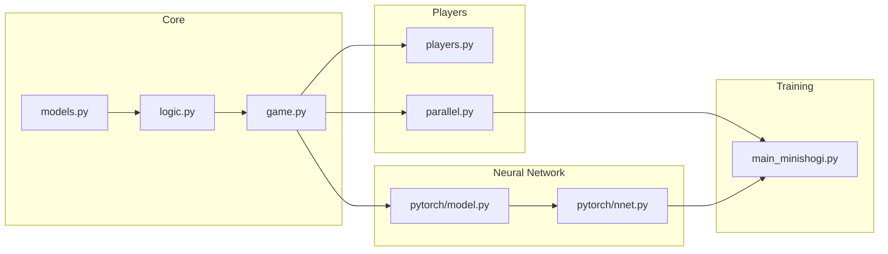
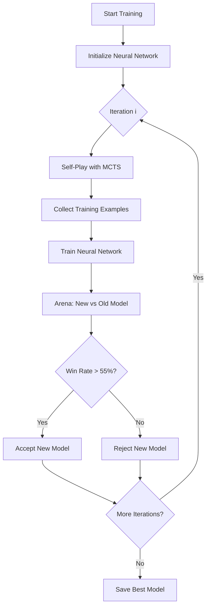
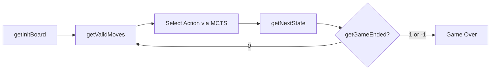

# MiniShogi - AlphaZero Implementation

A complete implementation of MiniShogi (5×5 Shogi) for the alpha-zero-general framework.

## Quick Start

```bash
# Install dependencies
uv sync

# Run tests
uv run pytest tests/test_minishogi*.py -v

# Play against random opponent
uv run python pit_minishogi.py

# Start training
uv run python main_minishogi.py --parallel
```

---

## Architecture



## Training Loop



## Game Flow



---

## Project Structure

```
minishogi/
├── models.py       # Pydantic data models
├── logic.py        # Board class & game rules
├── game.py         # MiniShogiGame (framework interface)
├── players.py      # RandomPlayer, HumanPlayer, GreedyPlayer
├── parallel.py     # Multiprocessing self-play
└── pytorch/
    ├── model.py    # CNN neural network
    └── nnet.py     # Training wrapper
```

---

## Game Rules

### Board Layout (Initial Position)
```
  0 1 2 3 4
  ---------
0|k g s b r   <- Player 2 (lowercase)
1|. . . . p
2|. . . . .
3|P . . . .
4|R B S G K   <- Player 1 (uppercase)
```

### Pieces
| Piece | Symbol | Promoted | Promotion Symbol |
|-------|--------|----------|------------------|
| King | K | - | - |
| Gold | G | - | - |
| Silver | S | ✓ | +S |
| Bishop | B | ✓ | +B (Dragon Horse) |
| Rook | R | ✓ | +R (Dragon King) |
| Pawn | P | ✓ | +P (Tokin) |

### Key Rules
- **Promotion Zone**: Row 0 for Player 1, Row 4 for Player 2
- **Drops**: Captured pieces can be dropped on empty squares
- **Two-pawn Rule**: Cannot have 2 unpromoted pawns in same column
- **Drop Pawn Checkmate**: Illegal to checkmate by dropping a pawn

---

## Action Space

Total actions: **1376**

| Type | Range | Formula |
|------|-------|---------|
| Moves | 0-1249 | `from_sq * 50 + to_sq * 2 + promote` |
| Drops | 1250-1374 | `1250 + (piece_type - 1) * 25 + to_sq` |
| Pass | 1375 | - |

---

## Neural Network

### Architecture
```
Input (5×5) → Conv2D×4 → FC(1024) → FC(512) → Policy(1376) + Value(1)
```

### Configuration (`NNetConfig`)
```python
NNetConfig(
    lr=0.001,
    dropout=0.3,
    epochs=10,
    batch_size=64,
    num_channels=256,
    cuda=True
)
```

---

## Training

### Standard Training
```bash
uv run python main_minishogi.py --iters 100 --episodes 100
```

### Parallel Training (Recommended)
```bash
uv run python main_minishogi.py --parallel --iters 100
```

Uses 8 CPU workers for self-play, GPU for neural network training.

### Resume Training
```bash
uv run python main_minishogi.py --load
```

---

## Playing

### Human vs Random
```bash
uv run python pit_minishogi.py
```

### Human vs Greedy
```bash
uv run python pit_minishogi.py --mode greedy
```

### Human vs Trained AI
```bash
uv run python pit_minishogi.py --mode ai --model ./minishogi_checkpoints/best.pth.tar
```

### Input Format
- Move: `from_row from_col to_row to_col [p]` (e.g., `3 0 2 0`)
- Drop: `d piece_type to_row to_col` (e.g., `d 1 2 2`)
- Piece codes: P=1, S=2, G=3, B=4, R=5
- Add `p` to promote

---

## API Reference

### MiniShogiGame
```python
from minishogi import MiniShogiGame

game = MiniShogiGame()
board = game.getInitBoard()          # Initial position
size = game.getActionSize()          # 1376
valids = game.getValidMoves(board, 1)  # Binary mask
new_board, player = game.getNextState(board, 1, action)
result = game.getGameEnded(board, 1)  # 0, 1, or -1
```

### Board
```python
from minishogi import Board

board = Board()
moves = board.get_legal_moves()      # List of Move objects
board.execute_move(move)
is_check = board.is_in_check(1)
print(board)                         # Display board
```

### Move
```python
from minishogi import Move, PieceType

# Regular move
move = Move(from_sq=(3, 0), to_sq=(2, 0), promote=False)

# Drop move
drop = Move(to_sq=(2, 2), drop_piece=PieceType.PAWN)

# Convert to/from action index
action = move.to_action_index()
move = Move.from_action_index(action)
```

---

## Testing

```bash
# All tests
uv run pytest tests/test_minishogi*.py -v

# Linting
uv run ruff check minishogi/

# Type checking
uv run mypy minishogi/ --ignore-missing-imports
```

---

## Dependencies

- `torch` - Neural network
- `numpy` - Board representation
- `pydantic` - Data models
- `tqdm` - Progress bars
- `fastapi` - Web backend
- `uvicorn` - ASGI server

Dev dependencies: `pytest`, `ruff`, `mypy`

---

## Web 前端

### 啟動開發伺服器

```bash
# Terminal 1: 後端 (Port 8000)
uv run uvicorn web.backend.main:app --reload --port 8000

# Terminal 2: 前端 (Port 5173)
cd web/frontend && npm run dev
```

訪問 **http://localhost:5173**

### 功能

| 頁面 | 網址 | 說明 |
|------|------|------|
| 對弈 | `/` | 人類 vs AI 即時對弈 |
| 訓練監控 | `/dashboard` | Loss 曲線、勝率、Checkpoints |
| 棋譜回放 | `/replay` | 查看/分享對局記錄 |

### Web 架構

```mermaid
graph TB
    subgraph Frontend["Vue 3 + Vite"]
        A[Game.vue] 
        B[Dashboard.vue]
        C[Replay.vue]
    end
    
    subgraph Backend["FastAPI"]
        D[/api/game]
        E[/api/train]
        F[/api/records]
    end
    
    A <-->|WebSocket| D
    B -->|REST| E
    C -->|REST| F
    D --> G[MiniShogi Core]
    E --> G
    F --> G
```

### API 端點

```
POST /api/game/new           建立新對局
GET  /api/game/{id}          取得對局狀態
POST /api/game/{id}/move     執行走法
GET  /api/game/{id}/analysis AI 分析
WS   /api/game/ws/{id}       即時對弈

GET  /api/train/status       訓練狀態
GET  /api/train/history      訓練歷史
GET  /api/train/checkpoints  模型清單

GET  /api/records            棋譜列表
GET  /api/records/{id}       單一棋譜
POST /api/records            儲存棋譜
GET  /api/records/{id}/share 分享連結
```
